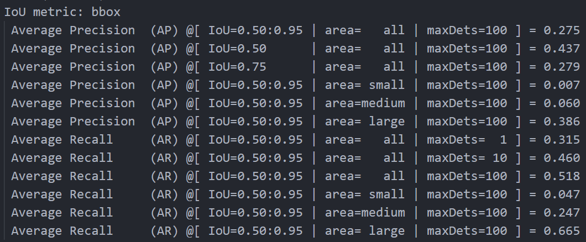
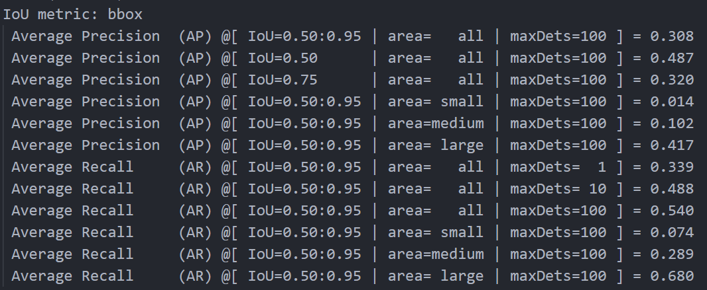

# README
## 简介
将YOLOS中的DeiT backbone替换为EVA-02 backbone，在Pascal VOC2012数据集上进行训练和测试。

硬件条件所限（单2080Ti），只进行了tiny模型的实验。数据集使用Pascal VOC2012数据集，数据集划分采用数据集内提供的train和val划分。

模型预训练参数：https://huggingface.co/Yuxin-CV/EVA-02/blob/main/eva02/cls/in1k/eva02_Ti_pt_in21k_ft_in1k_p14.pt

代码基于[YOLOS](https://github.com/hustvl/YOLOS)和[Timm](https://github.com/huggingface/pytorch-image-models)
## 结果
分别进行了论文原本基于DeiT-Tiny的YOLOS训练与测试和替换为EVA-02-tiny的训练与测试，分别在数据集上训练300轮。具体参数见main.py和run.sh。

结果如下：

YOLOS-DeiT-tiny

YOLOS-EVA-02-tiny

在EVA-02上finetune效果高于DeiT。

一些其他观察：
1. 根据训练结果，两个模型在300轮均并没有收敛。
2. YOLOS-DeiT在第一轮就已经可以产生0.11的AP，而YOLOS-EVA-02在训练刚开始并没有立即取得较高结果，但是始终以较为平稳的速度取得提升。
3. YOLOS-EVA-02在内存占用上优于YOLOS-DeiT，但是速度上更慢，大约比YOLOS-DeiT慢1.5倍。 
（不排除是因为我对模型的修改，在RoPE部分使用不确定输入尺寸的形式，因此这部分不能按照原代码中缓存位置编码）